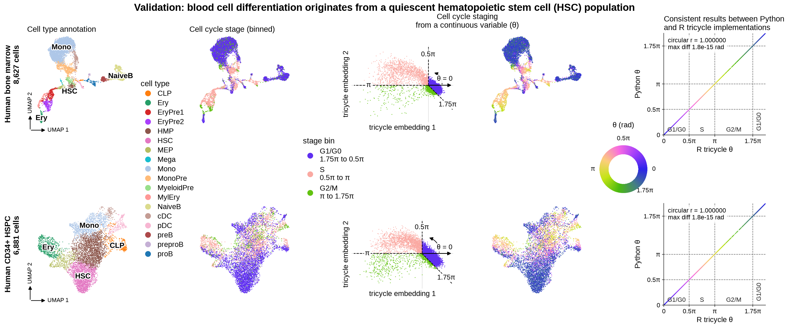

# tricycle-py

Cell cycle position from single-cell RNA-seq, in Python, on `AnnData`.

`tricycle-py` is a Python port of the R/Bioconductor package
[`tricycle`](https://github.com/hansenlab/tricycle) (Zheng et al., *Genome
Biology* 2022). It gives each cell a continuous cell cycle position: an angle
from 0 to 2π. It gets the angle by projecting log-normalised expression onto
a fixed reference embedding that `tricycle` learned from mouse neurosphere
cells. The reference works for human data as well.

The port follows `tricycle` 1.12.0 function by function, and reproduces its
output to floating-point precision.



*Two human multiome RNA datasets. Top row: bone marrow, 8,627 cells. Bottom
row: CD34+ hematopoietic stem and progenitor cells (HSPC), 6,881 cells. Each
column has one legend for both rows.*

| Column | What it shows |
|---|---|
| 1 | UMAP by cell type. Colours are the palette stored with the bone marrow object; the HSPC row uses the same colours, so one legend is true for both rows. The HSPC object stores its own, different palette. |
| 2 | UMAP by cell cycle position θ from this package, on tricycle's cyclic colour scale (0 and 2π share a colour). |
| 3 | UMAP by stage bin of θ. |
| 4 | The tricycle embedding by stage bin. θ is the angle of each cell about the origin: θ = 0 is the positive embedding 1 axis, and θ increases counter-clockwise. Dashed rays mark the bin edges. |
| 5 | Python θ against R `tricycle` θ for every cell, with dashed lines at the bin edges. Both axes run from 0 to 2π. Points are coloured by θ, as in column 2. Circular r is the Jammalamadaka-SenGupta circular correlation coefficient. |

*Stage bin edges come from the tricycle vignette (Zheng et al. 2022, Genome Biology
23:41): 0.5π is about the start of S, π the start of G2/M, and 1.75π to
0.25π is G1/G0. The vignette leaves 0.25π to 0.5π unassigned; here it goes
to G1/G0, so the bins cover the whole circle: G1/G0 is 1.75π to 0.5π through 0, S is 0.5π to π, and G2/M is π to 1.75π. The bins are a guide; θ
itself is continuous.*

## Install

```bash
pip install git+https://github.com/jacob-greene/tricycle-py
```

`uv pip install git+https://github.com/jacob-greene/tricycle-py` works too.
Python 3.10 or later. Add `[plot]` to the URL target for the plotting helpers,
which need `matplotlib`:
`pip install "tricycle-py[plot] @ git+https://github.com/jacob-greene/tricycle-py"`.

On an older Linux system, the newest `h5py` (a dependency of `anndata`) may
have no binary wheel and fail to build. Add `--only-binary h5py` to the
install command so that an older `h5py` wheel is used.

## Quick start

This runs as written. It uses the 400-cell example that ships with the package.

```python
import numpy as np
import tricyclepy as tp

adata = tp.datasets.neurosphere_example()   # mouse, log-normalised, Ensembl ids
tp.estimate_cycle_position(adata)           # writes adata.obs["tricyclePosition"]

theta = adata.obs["tricyclePosition"]       # radians, 0 to 2*pi
diff = np.angle(np.exp(1j * (theta - adata.obs["tricyclePosition_R"])))
print(f"max |Python - R| = {np.abs(diff).max():.1e} rad")
```

The example carries the position R `tricycle` computes on the same cells, so
the last line compares the two.

### Your own data

```python
tp.estimate_cycle_position(adata, species="human", gname_type="SYMBOL")
```

Two things must be right, and neither raises an error when wrong:

| Requirement | Why |
|---|---|
| `adata.X` holds log-normalised expression, not counts | The projection is a weighted sum of centred log-expression. Raw counts give wrong angles. Use `layer=` to read another layer. |
| `species` and `gname_type` describe your gene names | The defaults are `"mouse"` and `"ENSEMBL"`, as in R. For human symbols, pass `species="human", gname_type="SYMBOL"`. Use `gname=` if the names are in a `var` column. |

`adata.uns["tricycleEmbedding"]["n_genes"]` says how many of the 500
reference genes matched. A count far below a few hundred means a naming
mismatch.

The angle reads roughly as follows: 0.5π is near the start of S, π is near
the start of G2M, 1.5π is near the middle of M, and 1.75π to 0.25π is G1/G0.

More, including the discrete five-stage call, diagnostics, plots and learning
a new reference: [`docs/usage.md`](docs/usage.md).

## Agreement with R

The [`equivalence/`](equivalence/) harness runs R `tricycle` 1.12.0 and this
package on the same matrix and compares every cell. These numbers are from
8,627 human bone marrow cells, with 461 reference genes matched.

| Check | Result |
|---|---|
| Median circular difference in position | 0 rad |
| Maximum circular difference, any cell | 8.9e-16 rad |
| Five-stage call (`estimate_schwabe_stage`) identical | 8,627 of 8,627 cells |
| All four `species` and `gname_type` combinations | agree with R, same genes matched |

A deliberate change of 1e-9 to one reference weight makes the comparison
fail, so it is able to detect a real difference. The full tables, the known
differences from R, and how to reproduce them are in
[`docs/equivalence.md`](docs/equivalence.md).

## Speed and memory

Same cells, same machine, one process per measurement. Peak memory is the
peak resident set size and includes loading the data: 4,042 MB in R and
348 MB in Python before any function runs.

| Cells | Function | R seconds | Python seconds | R peak MB | Python peak MB |
|---:|---|---:|---:|---:|---:|
| 8,627 | `estimate_cycle_position` | 2.41 | 0.47 | 4,178 | 583 |
| 8,627 | `estimate_schwabe_stage` | 2.44 | 0.64 | 4,484 | 474 |
| 8,627 | `fit_periodic_loess`, exact surface | 8.29 | 5.97 | 4,186 | 1,593 |
| 103,524 | `estimate_cycle_position` | 12.54 | 7.74 | 11,605 | 3,869 |
| 103,524 | `estimate_schwabe_stage` | 18.67 | 5.45 | 11,812 | 4,370 |

The 103,524-cell rows repeat the 8,627 cells twelve times. R's default
`loess` is a faster approximation (0.76 s); the table compares the exact
computation on both sides. Raw numbers: [`equivalence/results/`](equivalence/results/).

## Citation

Please cite the original method:

> Zheng SC, Stein-O'Brien G, Augustin JJ, Slosberg J, Carosso GA, Winer B,
> Shin G, Bjornsson HT, Goff LA, Hansen KD. Universal prediction of cell cycle
> position using transfer learning. *Genome Biology* 23:41 (2022).
> doi:10.1186/s13059-021-02581-y

If you use `estimate_schwabe_stage`, cite Schwabe et al., *Molecular Systems
Biology* 16:e9946 (2020) as well. To cite this port, use
[`CITATION.cff`](CITATION.cff), or GitHub's "Cite this repository" button.

## Licence

GPL-3. `tricycle` is GPL-3, and this port is a derivative work, so it carries
the same licence. See [`ATTRIBUTION.md`](ATTRIBUTION.md) for credit to the
original authors and the licences of the shipped data.

This is an independent port. The `tricycle` authors do not endorse or support
it. Report problems with the port here.
